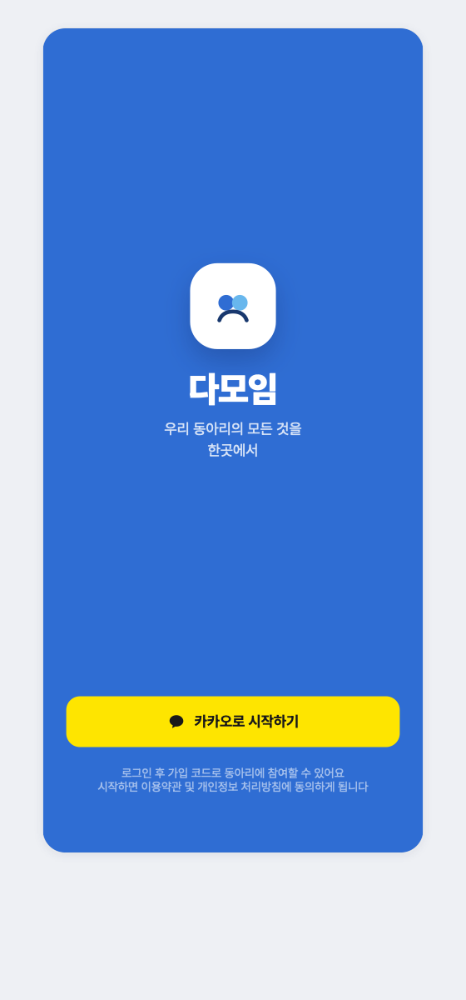
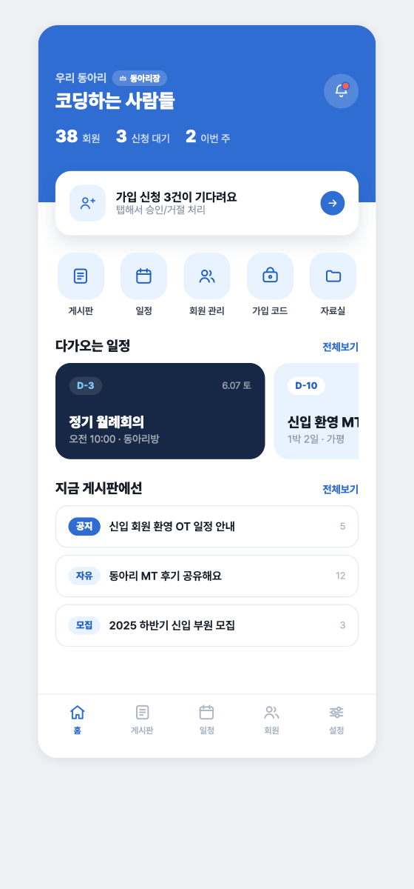
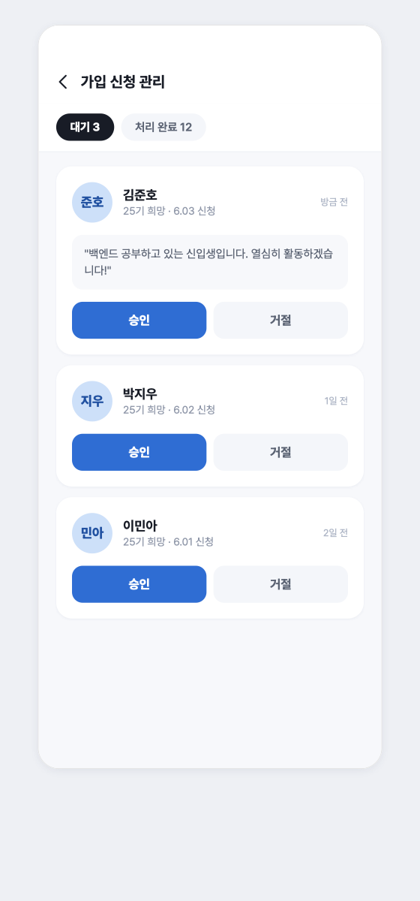
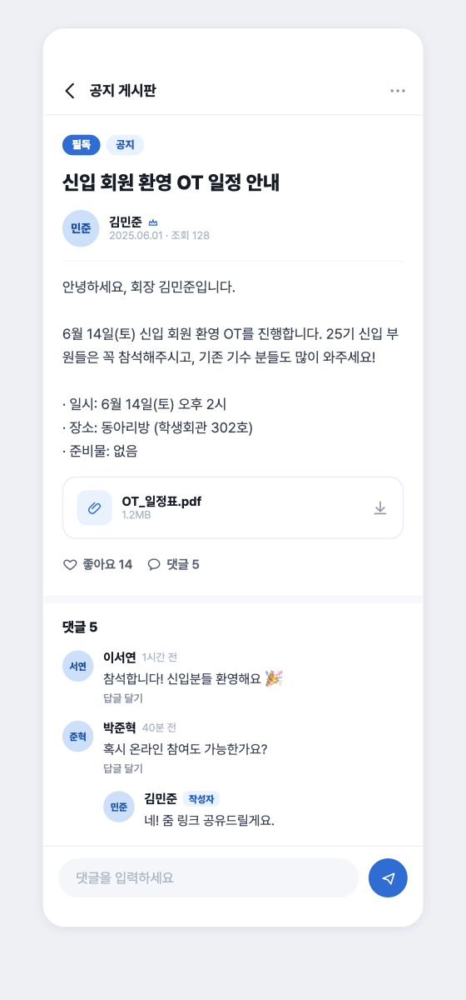
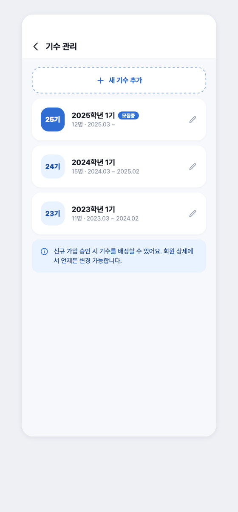
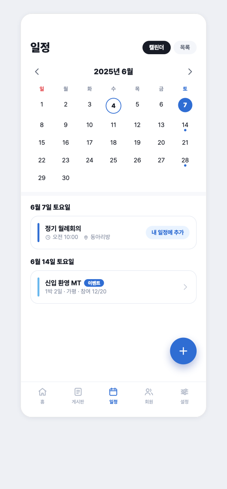
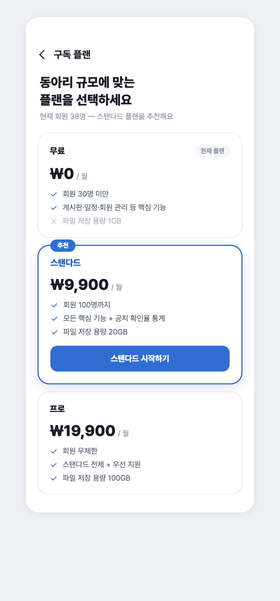
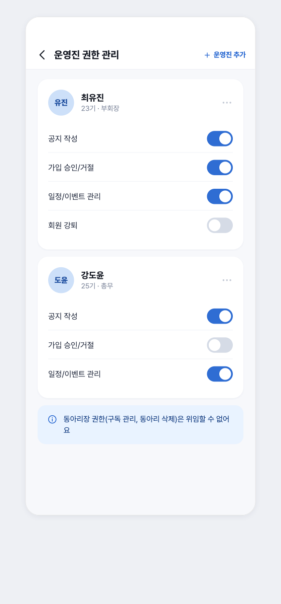

# 다모임 (Damoim)

> 동아리 종합 커뮤니티 플랫폼 — 파편화된 동아리 운영을 하나의 전용 앱으로.

**다모임**은 카카오톡 오픈채팅·네이버 카페로 흩어진 동아리 운영을
가입 코드 · 기수 관리 · 게시판 · 자료실 · 일정/이벤트 · 구독까지
하나로 통합하는 **Compose Multiplatform(Android · iOS)** 앱입니다.
UI 목업이 아니라 **자체 Ktor 서버([별도 레포](https://github.com/rudtjr1106/damoim-server))에 항상 연결되는 실동작 앱**이며,
Android 에뮬레이터와 iOS 시뮬레이터(카카오 로그인 포함)에서 실행을 검증했습니다.

<p>
  
  
  
  
  
</p>

---

## 📌 프로젝트 소개

| | |
|---|---|
| **한 줄 정의** | 동아리 종합 커뮤니티 플랫폼 (Android · iOS) |
| **타겟 사용자** | 학교·직장·취미 동아리의 **동아리장**과 **회원** |
| **아키텍처** | 단일 `:shared` 모듈에 5레이어 클린 아키텍처 + 자체 제작 MVI-lite |
| **서버 연동** | Ktor HttpClient로 REST 서버(별도 레포)에 **항상 연결** — Mock 없음 |
| **규모** | `commonMain` Kotlin 파일 **212**개 · 화면 **40**개 · ViewModel **36**개 · REST 도메인 **10**개 |

**해결하는 문제** — 동아리 운영자는 파편화된 소통 채널로 회원 관리·정보 공유에 어려움을 겪습니다.
다모임은 동아리에 특화된 기능(기수별 회원 관리, 가입 코드 승인제, 동아리장 전용 관리, 구독 플랜)을
하나의 앱으로 통합해 운영 효율을 높이고, 회원이 단일 공간에서 소통·공유하도록 지원합니다.

**사용자 시나리오** — 신입 회원이 **가입 코드**로 접속해 **카카오 로그인**으로 합류 →
동아리장이 승인하고 **기수**를 배정 → 회원은 **자유·모집·공지 게시판**과 **자료실**에서 소통·공유하고,
**캘린더/이벤트**로 MT·스터디 일정을 확인·신청합니다.

---

## 📱 화면

> 아래는 앱의 **디자인 시안**(Claude Design · 전체 86화면 중 A~G 대표 9종)을 렌더한 것입니다.
> 실제 앱은 이 화면들을 **서버 데이터로 구동**합니다.

<table>
  <tr>
    <td align="center"><br><b>로그인 · 온보딩</b><br><sub>카카오 간편 로그인</sub></td>
    <td align="center"><br><b>홈 (동아리장)</b><br><sub>대시보드 · 빠른 관리</sub></td>
    <td align="center"><br><b>가입 신청 관리</b><br><sub>승인/거절 · 기수 배정</sub></td>
  </tr>
  <tr>
    <td align="center"><br><b>게시글 상세</b><br><sub>댓글/답글 · 투표 · 첨부</sub></td>
    <td align="center"><br><b>자료실</b><br><sub>저장 용량 · presigned 업로드</sub></td>
    <td align="center"><br><b>기수 관리</b><br><sub>기수 배정/변경</sub></td>
  </tr>
  <tr>
    <td align="center"><br><b>일정 · 이벤트</b><br><sub>달력 · 참여 신청</sub></td>
    <td align="center"><br><b>구독 플랜</b><br><sub>플랜 · 인앱결제</sub></td>
    <td align="center"><br><b>운영진 권한</b><br><sub>세분 권한 위임</sub></td>
  </tr>
</table>

---

## ✨ 주요 기능

| # | 기능 | 핵심 내용 |
|---|---|---|
| 1 | **인증 · 가입** | 카카오 간편 로그인, 프로필 설정, 가입 코드 신청, 동아리장 승인/거절 |
| 2 | **동아리 생성 · 관리** | 동아리 생성·정보 설정, 가입 코드 발급/변경, 멀티 동아리 전환 |
| 3 | **게시판** | 자유·모집·공지 게시판, 글/댓글/답글, 첨부·투표·모집 신청, 핀·좋아요, 검색 |
| 4 | **자료실** | 자료 목록/상세, 저장 용량 관리, presigned 업로드(문서 피커·기수 공개범위) |
| 5 | **회원 · 기수 관리** | 회원 목록/상세·검색, 기수 배정/변경, 역할·권한 관리, 강퇴/탈퇴 |
| 6 | **일정 · 이벤트** | 실제 달력(월 이동), 동적 신청폼(선택형/주관식/복수), 참여 신청·정원 마감 |
| 7 | **구독 · 설정** | 구독 플랜·인앱결제(StoreKit2), 운영진 권한 위임, 알림 설정, 신고/문의 |

> 화면 설계 원본은 86개(그룹 A~H)이며 브랜드 컬러 `#2F6DD3` · Pretendard · 390×844 기준으로 제작했습니다.
> 이 중 실제 앱에 구현·서버 연동된 **A~G 전 그룹**이 아래 "구현 현황"에 정리되어 있습니다.

---

## 🛠 기술 스택

| 영역 | 사용 기술 |
|---|---|
| **UI** | Compose Multiplatform 1.11.1 · Material 3(1.11.0-alpha07) · Pretendard |
| **언어/플랫폼** | Kotlin 2.4.0 · KMP 단일 `:shared` (Android + iOS: `iosArm64`, `iosSimulatorArm64`) |
| **네트워킹** | Ktor 3.1.3 (Android=OkHttp / iOS=Darwin) · kotlinx.serialization 1.8.0 |
| **상태관리** | 자체 제작 MVI-lite (`StateFlow` 상태 + `Channel` 사이드이펙트) |
| **DI** | 수동 Service Locator (`object AppGraph`) — 외부 DI 프레임워크 미도입 |
| **네비게이션** | `SnapshotStateList` 기반 수동 백스택 (Navigation-Compose 미사용) |
| **플랫폼 브릿지** | `expect/actual` 8종 (카메라·문서 피커·공유·캘린더·인앱결제·이메일·백핸들러·이미지 압축) |
| **인증/결제** | 카카오 SDK (Android v2 / iOS SPM `kakao-ios-sdk` 2.28.0) · StoreKit2 |
| **공통 라이브러리** | Peekaboo 0.5.2(사진 피커) · qrose 1.0.1(QR) · kotlinx-datetime 0.7.1 |
| **빌드** | AGP 8.12.2 · Gradle 8.14 · minSdk 24 / target·compileSdk 36 · 바이트코드 JVM 11 (빌드 런타임 JDK 17) |

> 설계 원칙은 **의존성 최소주의**입니다. MVI 프레임워크·DI 라이브러리·Navigation-Compose 없이
> 상태관리·의존성 조립·네비게이션을 60여 줄의 베이스와 수동 백스택으로 직접 구현해
> 아키텍처 규율을 라이브러리가 아닌 **구조로 강제**했습니다.

---

## 🏗 아키텍처

`:shared` 한 모듈 안에서 레이어를 **패키지**로 분리합니다.
의존성 방향은 `presentation → domain ← data`이며, 공통 인프라는 `core`에 둡니다.

```
shared/src/commonMain/kotlin/com/damoim/app/
├─ core/                      # 프레임워크 비의존 공통 인프라
│  ├─ result/                 # DataResult(Success/Failure) · DataError
│  ├─ mvi/                    # BaseViewModel(MVI-lite) · UiState/UiSideEffect 마커
│  ├─ di/                     # AppGraph — 수동 Service Locator
│  ├─ social/                 # SocialLoginProvider (카카오 주입점)
│  └─ deeplink/               # 딥링크 소비
├─ domain/                    # 순수 Kotlin (플랫폼·프레임워크 0 의존)
│  ├─ model/                  # 도메인 모델 15
│  ├─ repository/             # 저장소 인터페이스 8
│  └─ usecase/                # UseCase 39
├─ data/
│  └─ remote/                 # 서버 통합 계층 (Mock 완전 제거)
│     ├─ core/                # ApiClient · ApiEnvelope · ApiRoutes · TokenStore
│     │                       #  RemoteBus · SessionEvents · RawHttp · HttpClientProvider …
│     └─ {auth,board,club,notification,        # 도메인별 Remote*Repository(인터페이스 유일 구현)
│         report,resource,schedule,settings}/  #  + *Dtos(@Serializable, 서버 JSON 1:1)
├─ platform/                  # expect 선언 (androidMain / iosMain 에 actual)
└─ presentation/
   ├─ RootNavHost.kt          # AppFlow(Loading/Auth/Main) 최상위 라우팅 판정
   ├─ MainNavHost.kt          # MainDestination 33개 수동 백스택
   ├─ theme/                  # DamoimTheme (Color · Type · Shape)
   ├─ component/              # 공용 UI (버튼·시트·다이얼로그·NetworkImage …)
   └─ <feature>/              # auth · home · board · club · member · profile
                              #  schedule · settings · resource · notification …
```

### 핵심 설계 결정

- **자체 제작 MVI-lite** — `abstract class BaseViewModel<S: UiState, E: UiSideEffect>` 하나가
  `StateFlow` 상태 노출 + `Channel` 사이드이펙트 + `handleResult(DataResult, onSuccess, onFailure)`
  공통 분기를 제공합니다. **36개 화면 ViewModel 전부**가 이 베이스를 상속해 화면마다 같은 패턴을 강제합니다.
- **화면당 3분할 규칙** — `XxxViewModel.kt`(State + SideEffect + VM) · `XxxScreen.kt`(무상태 `Route` 위임 +
  순수 `Screen` + `private @Preview`)로 나눕니다. 바텀시트/다이얼로그는 새 네비 목적지가 아니라
  `XxxOverlays.kt`의 `sealed interface` 오버레이를 **호출 화면 로컬 상태**로 렌더합니다.
- **공통 응답 봉투 일원화** — 서버의 `{success, data, error}`를 `ApiEnvelope<T>` → `DataResult`로 언랩하고,
  reified inline 래퍼(`ApiClient`)로 도메인 반복 코드를 제거했습니다. `expectSuccess=false`로 두어
  4xx/5xx도 예외가 아닌 **에러 봉투**로 일관 처리합니다.
- **JWT Bearer + 401 자동 리프레시** — Ktor `Auth` 플러그인이 매 요청에 토큰을 주입하고
  401 시 refresh 토큰으로 **회전(rotation)**, 리프레시 실패 시 전역 `SessionEvents`로 즉시 재로그인을 유도합니다.
  토큰은 Android=`SharedPreferences` / iOS=`NSUserDefaults`에 영속됩니다.
- **REST 반응형 동기화(`RemoteBus`)** — REST에 push가 없는 한계를,
  **도메인 단위 무효화 버스**(`DataTopic` 7종: CLUB·MEMBER·NOTIFICATION·BOARD·RESOURCE·SCHEDULE·SETTINGS)로 우회했습니다.
  변경이 일어난 topic만 무효화하고, 화면 재진입 시 해당 화면이 의존하는 topic만 재조회해
  불필요한 API 호출을 막습니다(`reactiveFlow` + `SharedFlows` 캐싱).
- **presigned 스토리지 분리** — 이미지/자료 업로드는 서버가 발급한 presigned URL에
  **인증 헤더 없는 별도 클라이언트(`RawHttp`)**로 직접 PUT 해, 앱 JWT가 S3 서명과 충돌하지 않도록 분리했습니다.
- **수동 네비게이션** — `SnapshotStateList` 기반 3단 백스택(App → Root → Auth/Main)을 직접 구현하고,
  목적지를 `sealed interface`로 타입 안전하게 표현했습니다. 콜드스타트와 로그인 직후를 하나의
  `resolveFlow()`로 판정하고, 시스템 뒤로가기는 `PlatformBackHandler(expect/actual)`로 통합했습니다.
- **크로스플랫폼 환경설정** — 서버 base URL은 `local.properties`(`server.base.url`) 단일 출처에서
  Android=`BuildConfig`, iOS=Gradle 코드생성(`IosBuildConfig`)으로 주입합니다.
  카카오 앱 키도 `local.properties → Gradle 태스크 → xcconfig → Info.plist` 파이프라인으로 흘려
  시크릿을 커밋에서 배제합니다.

> DI는 아직 정식 라이브러리(Koin) 도입 전으로, `object AppGraph`가 Remote 저장소(lazy 싱글턴)와
> UseCase(호출마다 생성)를 조립하는 **수동 Service Locator**입니다. 이는 의도된 현재 상태이며 로드맵에 명시했습니다.

---

## 🌐 서버 통합

`data/remote`가 도메인 인터페이스(`domain/repository` 8종)의 **유일한 구현**으로, `AppGraph`에서
단일 `ApiClient`를 공유 주입받습니다. 예전 문서의 "서버 없음 / Mock" 서술은 폐기되었고,
Mock 저장소는 **소스에서 완전히 제거**되었습니다.

| 도메인 | 대표 엔드포인트 | 주요 기능 |
|---|---|---|
| **auth** | `POST /api/auth/kakao` · `PATCH /api/me/profile` | 카카오 로그인·재검증, 프로필/이미지, 로그아웃, 회원탈퇴 |
| **club** | `/api/clubs/me/home` · `/api/clubs/join` | 홈 요약, 가입 코드, 기수, 지원자 심사, 동아리 전환 |
| **board** | `/api/board/posts` · `/comments` | 게시판 홈/목록/상세, 글·댓글 CRUD, 투표·좋아요·모집, 검색 |
| **resource** | `/api/resources` · `/upload-url` | 자료 목록/상세, 저장 용량, presigned 업로드/다운로드 |
| **schedule** | `/api/schedules` · `/apply` | 일정 CRUD, 참여 신청, 조기 마감, 공지 |
| **member** | `/api/members` | 명부·역할·기수 변경 (club 저장소가 커버) |
| **notification** | `/api/me/notifications` | 알림 목록, 전체/개별 읽음 |
| **settings** | `/api/subscription` · `/api/admins` | 구독 플랜·결제, 운영진 권한 토글, 알림 설정 |
| **report** | `/api/reports` | 신고 접수, 내 신고 내역, 운영진 신고 목록 |

REST 경로는 `ApiRoutes` 한 파일이 단일 출처이며 **10개 도메인 · 약 68개 라우트**를 정의합니다.
DTO는 도메인별 `*Dtos.kt`(`@Serializable`)가 서버 JSON과 1:1 매핑되고 `toDomain()`으로 도메인 모델로 변환됩니다.

---

## ✅ 구현 현황

디자인 **A~G 전 화면 그룹을 구현·서버 연동 완료**했습니다.
UI 목업이 아니라 실제 서버 데이터로 동작하며(로그인 → 가입 → 게시글/댓글 → 일정 신청 → 구독 결제),
**Android 에뮬레이터**와 **iOS 시뮬레이터**(카카오 로그인 SPM 통합) 실행을 검증했습니다.

| 그룹 | 상태 | 핵심 화면·기능 |
|---|:---:|---|
| **A. 인증 · 가입** | ✅ | 카카오 로그인 → 프로필 설정 → 가입 코드 입력 → 신청 완료/거절 |
| **B. 홈 · 동아리 관리** | ✅ | 홈(장/원 분기), 동아리 생성, 코드 발급/QR 공유, 가입 승인/거절, 알림 |
| **C. 게시판** | ✅ | 자유·공지·모집 게시판, 글/댓글/답글, 첨부·투표·모집 신청, 검색 |
| **D. 자료실** | ✅ | 자료실 홈(저장 용량), 상세, presigned 업로드(문서 피커·기수 공개범위) |
| **E. 회원 · 기수 관리** | ✅ | 회원 목록/상세, 기수 관리, 내 프로필, 멀티 동아리 전환 |
| **F. 일정 · 이벤트** | ✅ | 캘린더/목록, 동적 신청폼 빌더, 참여 신청(정원·아바타 실반영, 마감) |
| **G. 구독 · 설정** | ✅ | 설정 홈, 구독 플랜·인앱결제, 운영진 권한 위임, 알림 설정, 신고/문의 |

**엔지니어링 하이라이트**

- **경량 MVI-lite로 36개 화면 ViewModel 통일** — 외부 프레임워크 없이 60여 줄 베이스로 상태·사이드이펙트·결과 분기를 일관화.
- **`RemoteBus` 반응형 캐시 무효화** — REST push 부재를 도메인 topic 무효화로 재현, 재진입 시 필요한 데이터만 재조회.
- **JWT 리프레시 토큰 회전 + 세션 만료 전역 처리** — 실행 중 만료까지 UX로 흡수.
- **KMP 단일 소스 서버 계층** — HTTP 엔진만 소스셋 의존성(Android OkHttp / iOS Darwin)으로 분기, 코드 중복 0.
- **`expect/actual` 8종 플랫폼 브릿지** — Android Intent 계열 ↔ iOS UIKit/EventKit/StoreKit 델리게이트로 각각 관용 구현.
- **레지스트리 주입 브릿지 패턴** — 카카오 SDK·StoreKit2처럼 `shared`에 넣기 어려운 네이티브 의존성을
  Swift가 Kotlin 인터페이스를 구현해 앱 시작 시 등록하는 구조로 분리(`commonMain`은 SDK 의존성 0).

---

## 🚀 빌드 & 실행

**요구 사항** — Android Studio(AGP 8.12.2 호환 버전) · 빌드 런타임 JDK 17 · Gradle 8.14
서버 base URL과 카카오 앱 키는 `local.properties`에 설정합니다.

```properties
# local.properties
server.base.url=https://<your-server>      # iOS ATS 때문에 https 필수
kakao.native.app.key=<kakao-native-key>
ios.team.id=<apple-team-id>                # iOS 실기기 서명 시
```

**Android**
```bash
./gradlew :androidApp:assembleDebug        # 빌드
# 또는 Android Studio에서 :androidApp 실행
```

**iOS**
```bash
./gradlew :shared:generateIosSecretsXcconfig     # 최초 1회: 카카오 키 xcconfig 생성
./gradlew :shared:compileKotlinIosSimulatorArm64 # shared 프레임워크 컴파일(링크까지 확인)
# 이후 iosApp/ 을 Xcode로 열어 실행 (SPM: kakao-ios-sdk 2.28.0 자동 해석)
```

**테스트**
```bash
./gradlew :shared:testAndroidHostTest
./gradlew :shared:iosSimulatorArm64Test
```

> iOS는 Kotlin/Native가 Obj-C 상속 `object`의 코드 생성을 지원하지 않아 **링크 단계**에서만 드러나는 함정이 있어,
> 검증 시 컴파일이 아닌 링크까지 돌립니다(관련 폴백은 `class + lazy 싱글턴`으로 회피).

---

## 🗺 로드맵

- [x] A~G 전 화면 그룹 구현 + Ktor 서버 통합(Mock 완전 제거)
- [x] iOS 실행 검증 — 카카오 로그인 SPM 통합(시뮬레이터), StoreKit2 구독 브릿지
- [ ] DI 정식화: 수동 `AppGraph` → Koin
- [ ] 네비게이션: 수동 백스택 → `rememberSaveable` 복원 / Navigation-Compose 검토
- [ ] 출시 하드닝: 토큰 저장 Keychain/EncryptedSharedPreferences, 릴리즈 로깅 차단
- [ ] Android 인앱결제 Play Billing 실연동, 실기기 카카오 로그인·결제 검증
- [ ] `MainNavHost` 목적지 분할(현 단일 파일 33개 집중), 권한 게이팅 중앙화

---

<sub>Compose Multiplatform(Android · iOS) · Ktor · 브랜드 컬러 #2F6DD3 · Pretendard.
클라이언트와 서버([damoim-server](https://github.com/rudtjr1106/damoim-server))를 함께 설계·구현한 풀스택 개인 프로젝트입니다.</sub>
